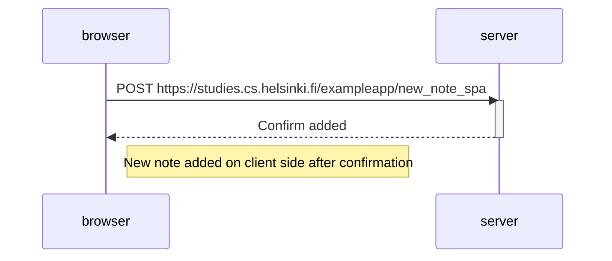

# Adding new note in the Single-Page App

```mermaid
sequenceDiagram
participant browser
participant server

    browser->>server: POST https://studies.cs.helsinki.fi/exampleapp/new_note_spa
    activate server
    server-->>browser: Confirm added
    deactivate server

    Note right of browser: New note added on client side after confirmation
```
